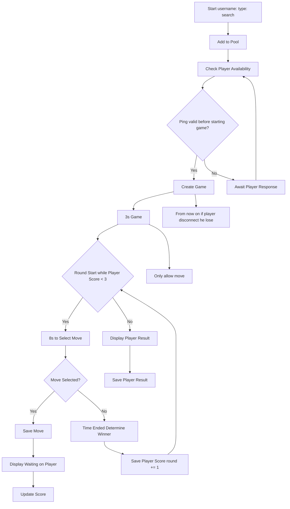

<div align="center">
  

  # Rock, Paper, Scissors Elite

  Most competitive Rock, Paper, Scissors game.

</div>


## Dev setup

Start tailwind watcher:
```bash
npx tailwindcss -i ./static/styles/input.css -o ./static/styles/output.css --minify
```


## Flow chart


